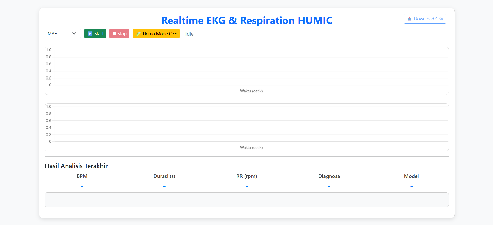
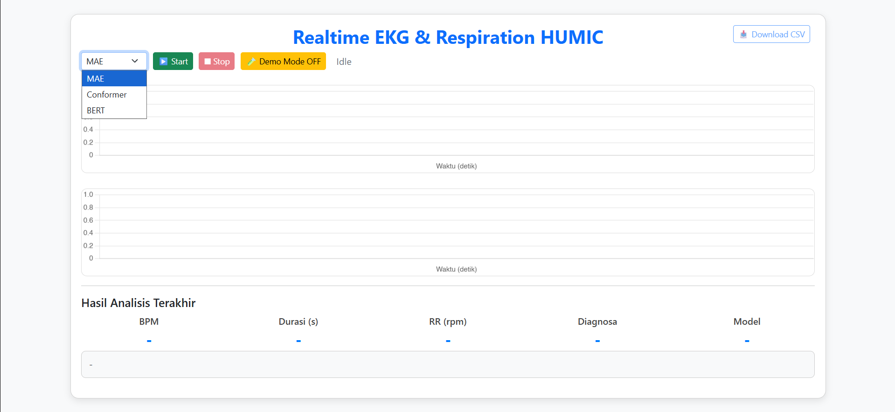
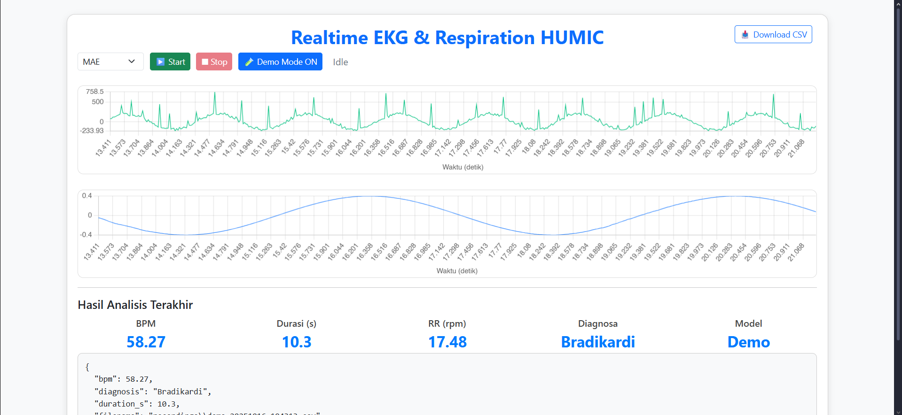

# Smart-ECG-AI
**Real-Time ECG and Respiration Monitoring with Multi-Model AI Analysis**

ECG-Respiration-HUMIC is a real-time biomedical signal monitoring system that acquires ECG and respiration signals using an ESP32 + ADS1292R module, streams them to a Flask web dashboard via WebSocket, and performs automatic ECG beat classification using multiple deep learning models (MAE, BERT, Conformer).

---

##  Features
-  **Wireless streaming** of ECG and respiration data from ESP32 to a web dashboard.
-  **Real-time visualization** using Chart.js.
-  **Multi-model analysis**: choose between MAE, BERT, and Conformer.
-  **AI classification** of ECG beats into clinical categories:
  - N (Normal Beat)
  - R (Right Bundle Branch Block)
  - L (Left Bundle Branch Block)
  - V (Ventricular Ectopic Beat)
  - Q (Unclassifiable Beat)
-  **Data recording** in `.csv` format.
-  **Flask + WebSocket backend** for efficient bi-directional data handling.
-  **Clean light-mode web UI** built with Bootstrap 5.

---

##  System Architecture
```text
ESP32 (ADS1292R) → Wi-Fi → Flask WebSocket Server → Realtime Dashboard
                                              ↘
                                                AI Model (MAE / BERT / Conformer)
```

## Web Dashboard Preview




## Pretrained Models

All model weights are stored externally due to GitHub size limitations.

| Model       | Description |
|--------------|-------------|
| MAE | Masked Autoencoder ECG classifier |
| Fold4 | Transformer-based ECG model |
| Conformer | Convolutional Transformer model |
| BERT | ECG-BERT classification model |
[Download](https://drive.google.com/drive/folders/1B4qpE2LI5TFhc7Kf0wdkXOwgabYEUR69?usp=sharing) |

After downloading, place each model into its corresponding folder under `/mae/weight/`, `/fold4/weight/`, `/conformer/weight/`, and `/bert/weight/`.